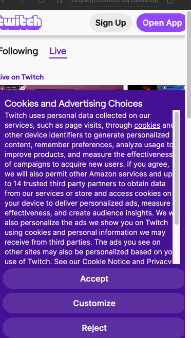

# Playwright + Pyton test framework

This project demonstrates a **UI test automation framework** using **Playwright** and **pytest** in Python.  
It includes **Page Object Model (POM)** structure, **mobile emulation**, **custom fixtures**, and **screenshot reporting**.

### Tech Stack
- Python 3.10+
- pytest
- Playwright

# Project structure
```text
├── config/
│   └── config.py        # Base url
│   └── devices.py        # Devices config
├── data/     # Folder in which testing data should be stored
├── pages/
│   └── base_page.py      # Basepage with common actions
│   └── main_page.py      # Main page class
│   └──search_page.py      # Search page class
│   └── streamers_page.py      # List with streamers/streaming pages class
│   └── streaming_page.py      # Video streaming page reports
├── screenshots/ #folder in which screenshots are stored from tests
├── tests/
│   └── test_streamer_page.py  #Test for video streaming page
├── conftest.py    #Pytest fixtures
├── requirements.txt           # Python dependencies
└── README.md                  # Project documentation
```
## Installation
#### Create virtual environment
```bash
python3 -m venv venv
#Activate the environment

# MacOS/ Linux
source venv/bin/activate 

# Windows
venv/Scripts/activate

```
#### Install python dependencies
```bash
pip install --upgrade pip
pip install -r ./requirements.txt
```
#### Install Playwright browsers
```bash
playwright install
```
## Writing and Executing Tests

This section explains how to write new tests in the framework and run them locally.

---

### Writing Tests

- All tests are stored in the `tests/` folder.
- Each test file should test a **single page or feature**.
- Use **pytest** naming conventions: test files start with `test_` and test functions start with `test_`.
#### POM
Each test has a class in `pages/`. BasePage provides common methods.

### Running tests
#### Run all tests
```bash
pytest -v --test-device android
```
- If --test-device is not set, tests will be run in default emulator which is iphone13 WebKit
- If you want to add more test devices edit `config/devices.py`

#### Run specific test file
```bash
pytest ./tests/test_video_streaming_device.py --test-device android
```
### Test runned locally
